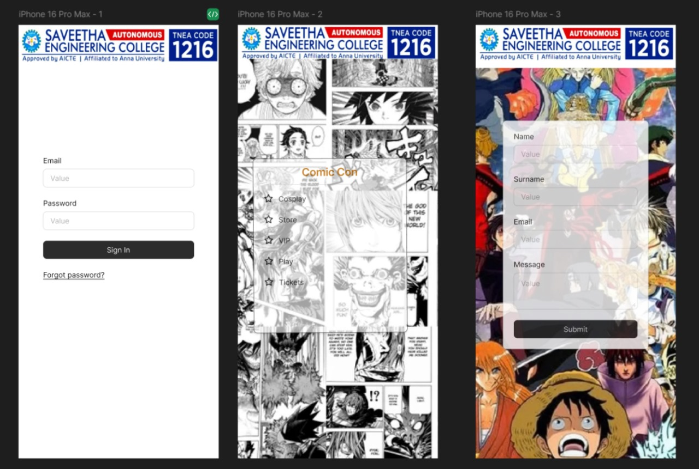

# Ex09 Event Registration Web Application
## Date:12-05-2025

## AIM:
To design, develop and deploy a web application for event registration.

## DESIGN STEPS:

### Step 1:
Create a new frame.

### Step 2:
Select any one preset size of your choice.

### Step 3:
Select the shapes you need.

### Step 4:
Import images as needed.

### Step 5:
Create pages based on your need and link them.

### Step 6:

Validate the HTML and CSS code.

### Step 6:

Publish the website in the given URL.

## DESIGN TOOL:
Figma

## CODE:
~~~
home page

  

    

      
Email

      

        
Value

      

    

    

      
Password

      

        
Value

      

    

    

      

        
Sign In

      

    

    

      
Forgot password?

    

  

  

page - 1

  
  

page - 2

  
  
  

    

      
Name

      

        
Value

      

    

    

      
Surname

      

        
Value

      

    

    

      
Email

      

        
Value

      

    

    

      
Message

      

        
Value

        

      

    

    

      

        
Submit

      

    

  

~~~

## OUTPUT:

## RESULT:
The program to design, develop and deploy a web application for event registration is completed successfully.
